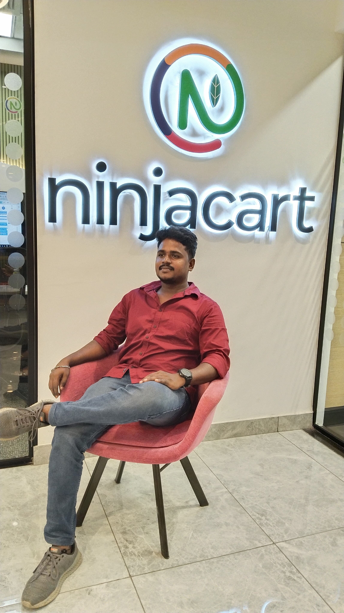

# 🌐 My Portfolio

Welcome to my personal portfolio!  
This project showcases my skills, experience, and projects in a clean and responsive design.

---

## 🚀 Live Demo
🔗 **[View Portfolio](https://jayaganesh.vercel.app)**  

---

## 📌 Features
- 🏠 **Home Page** – Quick introduction and hero section.
- 👤 **About Section** – Short bio and background.
- 🛠 **Skills Section** – Technologies and tools I use.
- 📂 **Projects Section** – Showcasing my work and achievements.
- 📞 **Contact Section** – Easy way to get in touch with me.

---

## 🛠 Tech Stack
- **HTML5**
- **CSS3**
- **JavaScript**
- **Bootstrap**
- **Responsive Design**

---

## 📷 Screenshots
| Home Page | Skills Page |
|----------|-------------|
|  |  |

---

## 🏗 How to Run Locally
1. Clone the repository:
   ```bash
   git clone https://github.com/jayaganesh3377/Jayaganesh.git
